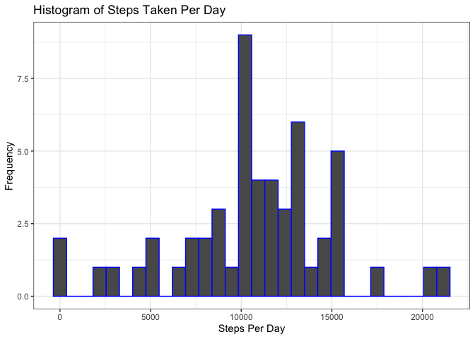
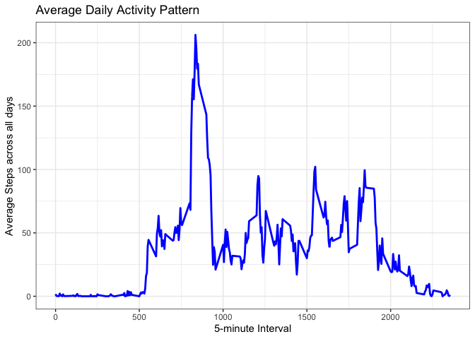
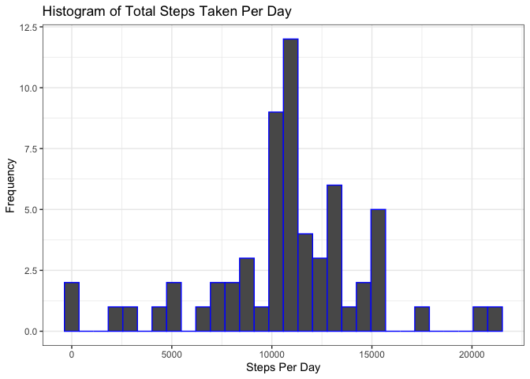
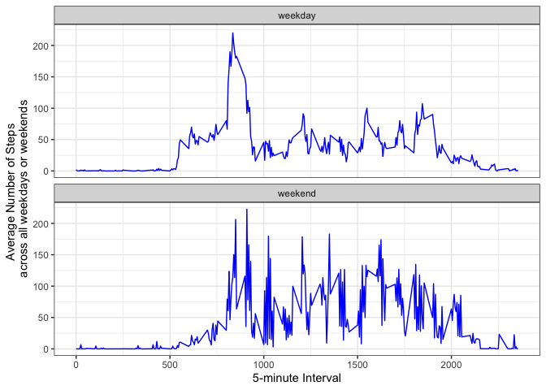

# Introduction

It is now possible to collect a large amount of data about personal movement using activity monitoring devices such as a Fitbit, Nike Fuelband, or Jawbone Up. These type of devices are part of the “quantified self” movement – a group of enthusiasts who take measurements about themselves regularly to improve their health, to find patterns in their behavior, or because they are tech geeks. But these data remain under-utilized both because the raw data are hard to obtain and there is a lack of statistical methods and software for processing and interpreting the data.

This assignment makes use of data from a personal activity monitoring device. This device collects data at 5 minute intervals through out the day. The data consists of two months of data from an anonymous individual collected during the months of October and November, 2012 and include the number of steps taken in 5 minute intervals each day.

# Dataset

The variables included in this dataset are:

- **steps**: Number of steps taking in a 5-minute interval (missing values are coded as **NA**)

- **date**: The date on which the measurement was taken in YYYY-MM-DD format

- **interval**: Identifier for the 5-minute interval in which measurement was taken

## Setting up the packages


```r
library(knitr)
knitr::opts_chunk$set(echo = TRUE)
library(tidyverse)
```

## Loading and preprocessing the data

**- Load the data (i.e. *read.csv()*)**


```r
### loading the data
activity <- unzip("activity.zip")
act <- read.csv("activity.csv", header=TRUE, sep=",")
str(act)
```

```
## 'data.frame':	17568 obs. of  3 variables:
##  $ steps   : int  NA NA NA NA NA NA NA NA NA NA ...
##  $ date    : chr  "2012-10-01" "2012-10-01" "2012-10-01" "2012-10-01" ...
##  $ interval: int  0 5 10 15 20 25 30 35 40 45 ...
```
**- Process/transform the data (if necessary) into a format suitable for your analysis**


```r
### processing the data
act <- act %>% 
        mutate(date = as.Date(date, format="%Y-%m-%d"))
head(act)  ### Print the header of the dataset
```

```
##   steps       date interval
## 1    NA 2012-10-01        0
## 2    NA 2012-10-01        5
## 3    NA 2012-10-01       10
## 4    NA 2012-10-01       15
## 5    NA 2012-10-01       20
## 6    NA 2012-10-01       25
```

## What is mean total number of steps taken per day?

#### 1. Calculate the total number of steps taken per day


```r
### calculate the sum of steps by date
act1 <- act %>% 
        group_by(date) %>% 
        summarise(steps_per_day = sum(steps)) %>% 
        mutate(steps_per_day = as.numeric(steps_per_day))
```

#### 2. Make a histogram of the total number of steps taken each day


```r
ggplot(act1, aes(x=steps_per_day)) + 
        geom_histogram(col = "blue") + 
        labs(x = "Steps Per Day", y = "Frequency") +
        ggtitle("Histogram of Steps Taken Per Day") +
        theme_bw()
```

<!-- -->

#### 3. Calculate and report the mean and median of the total number of steps taken per day


```r
### calculate the mean of sums of steps per day
act1 %>% select(steps_per_day) %>% 
        colMeans(na.rm = TRUE)
```

```
## steps_per_day 
##      10766.19
```

```r
### calculate the median of sums of steps per day
median(act1$steps_per_day, na.rm=TRUE)
```

```
## [1] 10765
```
The mean of the total number of steps taken per day is 10766.
The median of the total number of steps taken per day is 10765.

## What is the average daily activity pattern?

#### 1. Make a time series plot (i.e. *type = "l"*) of the 5-minute interval (x-axis) and the average number of steps taken, averaged across all days (y-axis)


```r
### calculate the mean of steps per day
act2 <- act %>% 
        group_by(interval) %>% 
        summarise(mean_steps = mean(steps, na.rm = TRUE)) 
head(act2)  ### Print the header of the dataset
```

```
## # A tibble: 6 × 2
##   interval mean_steps
##      <int>      <dbl>
## 1        0     1.72  
## 2        5     0.340 
## 3       10     0.132 
## 4       15     0.151 
## 5       20     0.0755
## 6       25     2.09
```


```r
### make a time series plot of the 5-minute interval (x-axis) and the
### average number of steps taken, averaged across all days (y-axis)
ggplot(act2, aes(x = interval, y = mean_steps)) + 
        geom_line(col = "blue", size = 1) + 
        labs(title = "Average Daily Activity Pattern", x = "5-minute Interval", 
             y = "Average Steps across all days") +
        theme_bw()
```

<!-- -->

#### 2. Which 5-minute interval, on average across all the days in the dataset, contains the maximum number of steps?


```r
### find max steps in all 5-min interval
max_interval <- act2[which.max(act2$mean_steps),]
max_interval
```

```
## # A tibble: 1 × 2
##   interval mean_steps
##      <int>      <dbl>
## 1      835       206.
```

```r
### alternative way to find max steps in all 5-min interval
max_steps <- max(act2$mean_steps)
act2 %>%
        filter(mean_steps == max_steps)
```

```
## # A tibble: 1 × 2
##   interval mean_steps
##      <int>      <dbl>
## 1      835       206.
```
The 835th 5-minute interval contains the maximum number of steps 206.

## Imputing missing values

Note that there are a number of days/intervals where there are missing values (coded as *NA*). The presence of missing days may introduce bias into some calculations or summaries of the data.

#### 1. Calculate and report the total number of missing values in the dataset (i.e. the total number of rows with *NA*s)


```r
### calculate the number of rows with NA
is_complete <- complete.cases(act)
sum(!is_complete)
```

```
## [1] 2304
```

#### 2. Devise a strategy for filling in all of the missing values in the dataset. The strategy does not need to be sophisticated. For example, you could use the mean/median for that day, or the mean for that 5-minute interval, etc.


```r
### impute NA with mean steps for that day
avg_interval <- act %>%
        group_by(interval) %>%
        summarise(avg_steps = mean(steps, na.rm = TRUE))
```

#### 3. Create a new dataset that is equal to the original dataset but with the missing data filled in.


```r
### create a new dataset that is equal to the original dataset with the missing data filled in
act_imputed <- act
    for (i in 1:nrow(act_imputed)) {
            if (is.na(act_imputed[i, "steps"]) == TRUE) {
                   data_interval <- act_imputed[i, "interval"]
                   imputed_value <- avg_interval[avg_interval$interval == data_interval, "avg_steps"]
                   act_imputed[i, "steps"] <- imputed_value
            } else {
                act_imputed[i, "steps"] <- act_imputed[i, "steps"]
            }
    }

head(act_imputed)
```

```
##       steps       date interval
## 1 1.7169811 2012-10-01        0
## 2 0.3396226 2012-10-01        5
## 3 0.1320755 2012-10-01       10
## 4 0.1509434 2012-10-01       15
## 5 0.0754717 2012-10-01       20
## 6 2.0943396 2012-10-01       25
```


```r
### check number of rows with NA in imputed dataset
is_complete <- complete.cases(act_imputed)
sum(!is_complete)
```

```
## [1] 0
```

#### 4. Make a histogram of the total number of steps taken each day and Calculate and report the **mean** and **median** total number of steps taken per day. Do these values differ from the estimates from the first part of the assignment? What is the impact of imputing missing data on the estimates of the total daily number of steps?


```r
### calculate the total number of steps per day with imputed dataset
act3 <- act_imputed %>%
    group_by(date) %>%
    summarise(total_steps = sum(steps, na.rm = TRUE))
### make a histogram of the total number of steps taken each day
ggplot(act3, aes(x = total_steps)) +
    geom_histogram(col = "blue") + 
    labs(x = "Steps Per Day", y = "Frequency") +
    ggtitle("Histogram of Total Steps Taken Per Day") +
    theme_bw()
```

<!-- -->

```r
### calculate and report the mean and median total number of steps taken per day
mean(act3$total_steps)
```

```
## [1] 10766.19
```

```r
median(act3$total_steps)
```

```
## [1] 10766.19
```
The mean of the total number of steps taken per day is 10766.
The median of the total number of steps taken per day is 10766.

These values differ from the estimates from the first part of the assignment. As we impute missing data on the estimates of the total daily number of steps, the mean and the median of the total number of steps taken per day are now exactly the same which is not the case before imputation.

## Are there differences in activity patterns between weekdays and weekends?

For this part the **weekdays()** function may be of some help here. Use the dataset with the filled-in missing values for this part.

#### 1. Create a new factor variable in the dataset with two levels – “weekday” and “weekend” indicating whether a given date is a weekday or weekend day.


```r
### create a new factor variable in the dataset with two levels 
### “weekday” and “weekend” indicating whether a given date is a weekday or weekend day
act_imputed <- act_imputed %>% 
    mutate(weekday = ifelse(weekdays(date) == c("Saturday", "Sunday"), "weekend", "weekday"))
```

#### 2. Make a panel plot containing a time series plot (i.e.**type = "l"**) of the 5-minute interval (x-axis) and the average number of steps taken, averaged across all weekday days or weekend days (y-axis). See the README file in the GitHub repository to see an example of what this plot should look like using simulated data.


```r
### calculate the average number of steps per day across weekdays/ weekends
act4 <- act_imputed %>%
    group_by(interval, weekday) %>%
    summarise(avg_steps = mean(steps, na.rm = TRUE))

### make a panel plot containing a time series plot of the 5-minute interval (x-axis) 
### and the average number of steps taken, averaged across all weekday days or weekend days (y-axis)
ggplot(act4, aes(x = interval, y = avg_steps)) +
    geom_line(color = "blue") +
    facet_wrap(~weekday, nrow=2) +    ### Divide by weekday, going horizontally
    labs(x = "5-minute Interval", 
         y = "Average Number of Steps \n across all weekdays or weekends") +
    theme_bw()
```

<!-- -->
